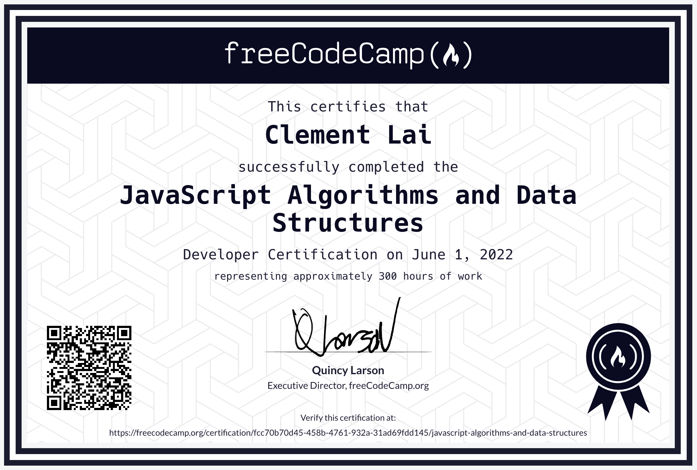

# JavaScript-Algorithms-and-Data-Structures
FreeCodeCamp JavaScript Algorithms and Data Structures Certification, showcasing problem-solving skills. Explore projects, each passing automated test suites. Demonstrates a commitment to mastering fundamental algorithms and data structures in JavaScript.

## Projects

### 1. Palindrome Checker
- **Description:** Check if a given string is a palindrome.
- **Link:** ([[https://codepen.io/mrwednesday33/pen/NWrQOPP](https://github.com/mrwednesday33/JavaScript-Algorithms-and-Data-Structures/blob/main/caesars-cipher/index.js](https://github.com/mrwednesday33/JavaScript-Algorithms-and-Data-Structures/blob/main/caesars-cipher/index.js))

### 2. Roman Numeral Converter
- **Description:** Convert a given number to a Roman numeral.
- **Link:** [Roman Numeral Converter](https://codepen.io/mrwednesday33/pen/rNJeOQw)

### 3. Caesars Cipher
- **Description:** Implement the Caesar's Cipher algorithm.
- **Link:** [Caesars Cipher](https://codepen.io/mrwednesday33/pen/poWgojQ)

### 4. Telephone Number Validator
- **Description:** Validate if a given string is a valid US phone number.
- **Link:** [Telephone Number Validator](https://codepen.io/mrwednesday33/pen/vYxBQPJ)

### 5. Cash Register
- **Description:** Implement a cash register with various currency units.
- **Link:** [Cash Register](https://codepen.io/mrwednesday33/pen/oNwwZpY)

## Certification

